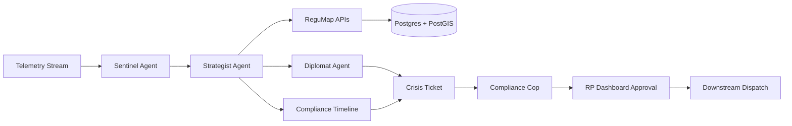

# PharmaGuard AI

<p align="center">
	
</p>

<p align="center">
	
</p>

<p align="center">
	
	
	
	
	
</p>

---

## What This Project Does

PharmaGuard AI is a crisis-response platform for pharmaceutical cold-chain logistics.

It monitors shipment telemetry, detects risk events, generates alternative routes, validates route compliance across jurisdictions, and presents approval-ready options to Responsible Persons before dispatch actions are executed.

Core system outcomes:

- Real-time anomaly detection and escalation
- Route generation for air and maritime transport
- Spatial compliance intelligence powered by geospatial data
- Human-in-the-loop decision control with auditability

---

## Architecture Snapshot



---

## Repository Structure

```text
jarvis-ai/
├── backend/
│   ├── app/
│   ├── scripts/
│   │   ├── eda_logistics_datasets.py
│   │   ├── etl_logistics_spatial_supabase.py
│   │   └── migrate_logistics_to_supabase.py
│   └── sql/
│       ├── logistics_setup.sql
│       ├── logistics_fk_and_gist.sql
│       ├── logistics_spatial_indexes.sql
│       └── logistics_cleanup.sql
├── frontend/
└── data/
		├── world_airports.csv
		├── UpdatedPub150.csv
		├── airlines.csv
		├── routes.csv
		└── Shipping_Lanes_v1.geojson
```

---

## Data Engineering Workflow

### 1) Run EDA Validation

The EDA script checks:

- Null coordinates in airport and seaport source files
- Latitude/longitude range violations
- Orphaned aviation routes where source or destination IATA is not in airports

Command:

```bash
python backend/scripts/eda_logistics_datasets.py --data-dir "D:/MS/UMD/Courses/Spring-2026/Agentic-AI/jarvis-ai/data"
```

Outputs are written to:

- data/eda_reports/eda_summary.json
- data/eda_reports/airports_null_coordinates.csv
- data/eda_reports/seaports_null_coordinates.csv
- data/eda_reports/airports_invalid_coordinate_ranges.csv
- data/eda_reports/seaports_invalid_coordinate_ranges.csv
- data/eda_reports/routes_orphaned_iata.csv

### 2) Run Spatial ETL into Supabase

ETL script capabilities:

- Ensures PostGIS extension is enabled
- Loads airports and builds geography points
- Loads seaports with mapped names and LOCODE aliases plus geography points
- Builds aviation route geography linestrings from airport coordinates
- Loads maritime lanes from GeoJSON as geography multilinestrings
- Adds/validates foreign key constraints and creates GIST indexes

Command:

```bash
python backend/scripts/etl_logistics_spatial_supabase.py --data-dir "D:/MS/UMD/Courses/Spring-2026/Agentic-AI/jarvis-ai/data"
```

The script reads DATABASE_URL from backend/.env unless passed explicitly.

---

## SQL Toolbelt

Use these SQL files for setup, optimization, and rollback:

- backend/sql/logistics_setup.sql
- backend/sql/logistics_fk_and_gist.sql
- backend/sql/logistics_spatial_indexes.sql
- backend/sql/logistics_cleanup.sql

---

## Tech Stack

### Backend

- FastAPI
- SQLAlchemy
- Pydantic
- Python

### Data & Geospatial

- PostgreSQL (Supabase)
- PostGIS
- GeoPandas
- Shapely
- Pandas

### Frontend

- Next.js
- TypeScript
- Component-driven dashboard architecture

---

## Quick Start

### Backend

```bash
cd backend
uv sync
uv run uvicorn app.main:app --host 0.0.0.0 --port 8000 --reload
```

### Frontend

```bash
cd frontend
pnpm install
pnpm dev
```

---

## Visual Identity

<p align="center">
	
</p>

This project is designed for command-center workflows:

- Fast signal-to-decision UX
- High-contrast, role-specific views
- Geospatial-first compliance context

---

## License

Academic project for UMD Agentic AI Challenge 2026.

