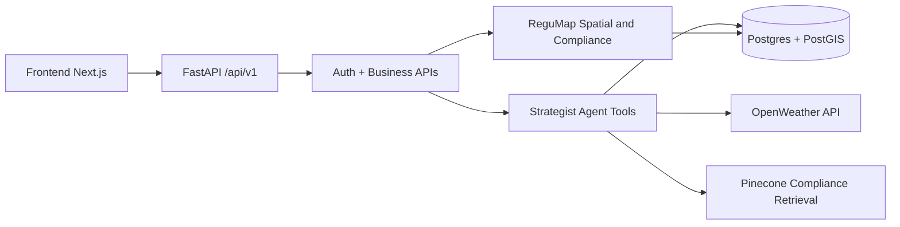

# PharmaGuard AI

<p align="center">
  
</p>

<p align="center">
  
</p>

<p align="center">
  
  
  
  
  
</p>

PharmaGuard AI is a cold-chain intelligence platform for pharmaceutical logistics. It combines real-time telemetry monitoring, route planning, geospatial compliance checks, and human-in-the-loop approval workflows.

This README is structured for two goals:

- Understand exactly what has been implemented in the prototype
- Reproduce the system locally with minimal guesswork

Planning context referenced:

- `Planning/PRD_JarvisAI.md`
- `Planning/PRD_v1.3.md`
- `Planning/APP_FLOW_JarvisAI.md`

## Table of Contents

1. Problem and Solution Scope
2. What Is Implemented
3. Architecture
4. Repository Structure
5. Data and ETL Workflow
6. API Surface
7. Detailed Replication Guide
8. Demo Walkthrough
9. Remaining Work and Known Issues
10. Submission Package

## 1) Problem and Solution Scope

Pharmaceutical cold-chain shipments are vulnerable to temperature excursions, routing disruptions, and cross-border compliance complexity. PharmaGuard AI addresses this by:

- Monitoring shipment context and telemetry
- Generating route alternatives (air and maritime)
- Evaluating risk (thermal, humidity, geopolitical, operational)
- Performing jurisdiction-aware compliance checks
- Presenting a decision-ready interface for Responsible Person (RP) approval

## 2) What Is Implemented

### Backend capabilities

- FastAPI service with versioned API under `/api/v1`
- Auth endpoints and role-aware request handling
- Shipment ingest and parse pipeline for PO documents
- Strategist route planning endpoint returning ranked candidate routes
- ReguMap route analysis stack:
  - route planning
  - route geometry retrieval
  - spatial jurisdiction inference
  - compliance check response enrichment
- Risk scoring that includes:
  - thermal risk
  - humidity penalty
  - geopolitical/customs risk
  - operational complexity risk
- OpenWeather integration for route-level weather temperature context
- Crisis and telemetry related services and orchestration hooks

### Frontend capabilities

- Next.js application with role-oriented pharma dashboard views
- ReguMap route planner UI with:
  - origin/destination search
  - transit mode and cargo type selection
  - route option selection
  - compliance timeline cards
  - route risk summary
- Map rendering with MapLibre + deck.gl overlays:
  - selected route geometry
  - alternate route arcs
  - multi-hop arc segments when waypoints include intermediate nodes
  - weather-aware selected-route color signal and weather badge

### Data and geospatial capabilities

- Scripts for EDA and ETL of airports, routes, seaports, and maritime lanes
- PostGIS-backed spatial querying and line geometry operations
- Jurisdiction extraction from route waypoints

## 3) Architecture

### High-level component map



### Runtime flow for ReguMap

1. Frontend calls strategist plan endpoint with origin, destination, cargo.
2. Backend generates candidate routes and scores them.
3. Frontend selects a route and requests geometry.
4. Frontend runs spatial-check to infer jurisdictions.
5. Frontend runs compliance-check for enriched rule output.
6. Map renders selected route plus alternate candidate arcs.
### Strategist dual-flow model (PRD v1.3)

- Proactive flow: dashboard Analyze triggers `/api/v1/strategist/plan`, ranks candidates, and persists planning sessions.
- Reactive flow: Sentinel crisis event triggers reroute generation, risk/compliance ranking, and crisis ticket hydration.
- Both flows share route generation and risk scoring primitives but diverge in persistence and approval lifecycle.

### Backend API router composition

API routers included under `/api/v1`:

- `/auth`
- `/regumap`
- `/telemetry`
- `/locations`
- `/strategist`
- `/shipments`

## 4) Repository Structure

```text
jarvis-ai/
|- backend/
|  |- app/
|  |  |- api/v1/
|  |  |- schemas/
|  |  |- services/
|  |  |- lib/
|  |- agents/
|  |- scripts/
|  |- sql/
|- frontend/
|  |- app/
|  |- components/pharma/
|  |- lib/
|- data/
|- docs/submission/
```

## 5) Data and ETL Workflow

### Step A: EDA checks

```bash
python backend/scripts/eda_logistics_datasets.py --data-dir "./data"
```

Expected outputs are written to `data/eda_reports/`.

### Step B: Spatial ETL

```bash
python backend/scripts/etl_logistics_spatial_supabase.py --data-dir "./data"
```

This prepares airports/seaports/routes/maritime_lanes data and spatial indexes in Postgres/PostGIS.

## 6) API Surface

Representative endpoints (not exhaustive):

- `POST /api/v1/strategist/plan`
- `GET /api/v1/strategist/tickets/latest`
- `POST /api/v1/strategist/tickets/{ticket_id}/approve`
- `POST /api/v1/regumap/analyze-route`
- `POST /api/v1/regumap/route-geometry`
- `POST /api/v1/regumap/spatial-check`
- `POST /api/v1/regumap/compliance-check`
- `GET /api/v1/telemetry/latest`
- `GET /api/v1/locations/active-shipments`
- `POST /api/v1/shipments/parse-po`
- `POST /api/v1/shipments/create`

## 7) Detailed Replication Guide

Python dependency files in repo root:

- `requirements.txt` for runtime dependencies
- `requirements-dev.txt` for lint/test/type-check tooling


### 7.1 Prerequisites

- Python 3.11+
- Node.js 20+
- pnpm 9+
- PostgreSQL with PostGIS (or Supabase Postgres)

### 7.2 Clone and open

```bash
git clone https://github.com/amansahu205/jarvis-ai.git
cd jarvis-ai
```

### 7.3 Backend environment

Create `backend/.env` with required values:

```env
APP_ENV=development
APP_NAME=JarvisAI
DEBUG=true
DATABASE_URL=<postgres-connection-string>
JWT_SECRET=<secret>
AGENT_TOKEN_SECRET=<secret>
FRONTEND_URL=http://localhost:3000,http://127.0.0.1:3000

# Optional integrations
GEMINI_API_KEY=
PINECONE_API_KEY=
PINECONE_INDEX_NAME=jarvis-compliance
OPENWEATHER_API_KEY=
ANTHROPIC_API_KEY=
ELEVENLABS_API_KEY=
ELEVENLABS_AGENT_ID=
TWILIO_ACCOUNT_SID=
TWILIO_AUTH_TOKEN=
TWILIO_PHONE_NUMBER=
RP_PHONE_NUMBER=
```

Install and run backend:

```bash
cd backend
python -m venv .venv
# Windows PowerShell
.venv/Scripts/Activate.ps1
pip install -U pip
pip install -e .
python -m uvicorn app.main:app --host 0.0.0.0 --port 8000 --reload
```

Notes:

- App startup runs table creation and starts sentinel monitor background task.
- Open API docs are available at `http://127.0.0.1:8000/docs` when `DEBUG=true`.

### 7.4 Frontend environment

Create `frontend/.env.local`:

```env
NEXT_PUBLIC_API_URL=http://127.0.0.1:8000
```

Install and run frontend:

```bash
cd frontend
pnpm install
pnpm dev
```

Open `http://localhost:3000`.

### 7.5 Optional: data preparation flow

From repository root:

```bash
python backend/scripts/eda_logistics_datasets.py --data-dir "./data"
python backend/scripts/etl_logistics_spatial_supabase.py --data-dir "./data"
```

### 7.6 Smoke test flow

1. Start backend and frontend.
2. Go to ReguMap page.
3. Select origin and destination.
4. Click analyze route.
5. Confirm:
   - route options appear
   - compliance timeline populates
   - map shows selected path + alternate arcs
   - weather badge appears when OpenWeather key is configured

## 8) Demo Walkthrough

A concise live demo sequence:

1. Show planner inputs (origin, destination, transit mode, cargo).
2. Run analysis and display ranked route options.
3. Switch between route options and show map updates.
4. Open compliance timeline and cite jurisdiction cards.
5. Show risk and weather-informed route signal.

## 9) Remaining Work and Known Issues

### Remaining work

- Improve multi-hop realism by returning richer intermediate waypoint coordinates from backend pathfinding.
- Expand compliance knowledge coverage beyond fallback rules for more country classes.
- Add comprehensive automated tests for strategist/regumap integration paths.
- Add production-grade observability dashboards and health probes.
- Finalize and harden crisis approval workflow end-to-end with audit replay.

### Known issues observed

- Frontend TypeScript has existing errors in non-ReguMap three.js related components (`mobile-blocker`, `three-background`) and one map-container typing issue.
- Browser console can show React root unmount race warnings in map marker lifecycle during fast re-renders.
- Some shipment queries may fail against certain live schemas if expected legacy columns are missing in deployed DB variants.
- Graph rebuild command currently fails in this environment when `graphify` module is unavailable.

## 10) Submission Package

Submission support docs are available in `docs/submission/`:

- `SUBMISSION_METADATA.md`
- `INITIAL_SOLUTION_PACKAGE_CHECKLIST.md`
- `REPRODUCIBILITY_AND_USAGE_DRAFT.md`
- `DEMO_VIDEO_SHOTLIST.md`
- `SUPPORTING_FILES_INDEX.md`
- `SUBMISSION_READINESS_AUDIT_2026-04-15.md`

Recommended submission flow:

1. Fill `SUBMISSION_METADATA.md`.
2. Export reproducibility document to PDF (max 5 pages).
3. Upload demo video (max 5 minutes) and verify public access in incognito mode.
4. Attach optional supporting files links.

## License

Academic project for UMD Agentic AI Challenge 2026.


